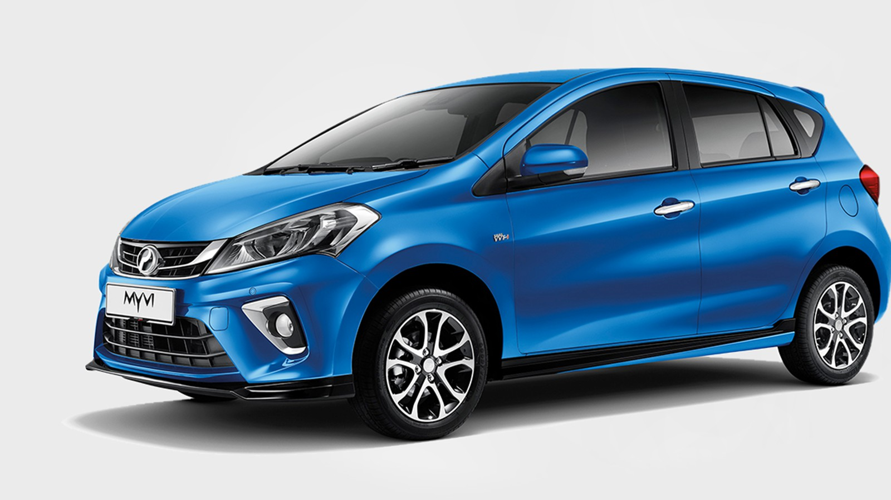
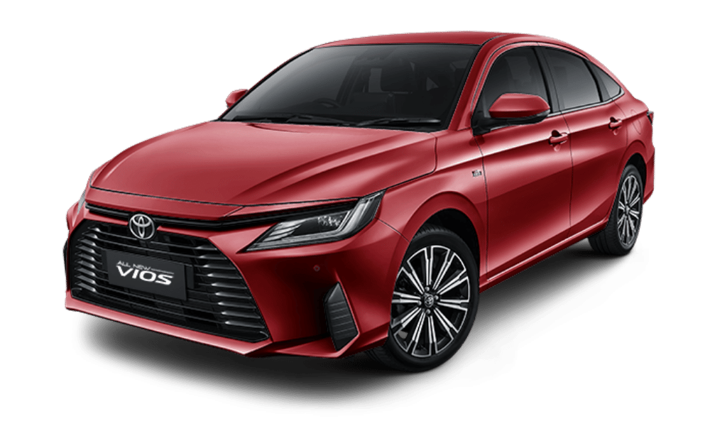

# 🚗 Flutter Car Rental App

A complete mobile application built with Flutter for a car rental service. Users can view available cars, check specifications, and make bookings directly from the app.

---

## 📱 Features

- 🏠 Home screen with navigation to all features
- 🚘 Car list with images, capacity, and price
- 📄 Car details with full specifications
- 📆 Booking system with summary confirmation
- 🔔 Notifications for booking status
- 🔐 Login & Registration system
- 🎨 Modern responsive UI

---

## 🛠️ Tech Stack

- Flutter
- Dart
- Firebase Authentication (if used)
- Local Storage / Shared Preferences
- Google Fonts & UI Widgets

---

## 📸 Screenshots (optional)

| Welcome Screen | Car List | Booking |
|----------------|----------|---------|
|  |  |  |

---

## 🚀 How to Run

```bash
git clone https://github.com/project-car-rental-system/flutter-car-rental.git
cd flutter-car-rental
flutter pub get
flutter run
